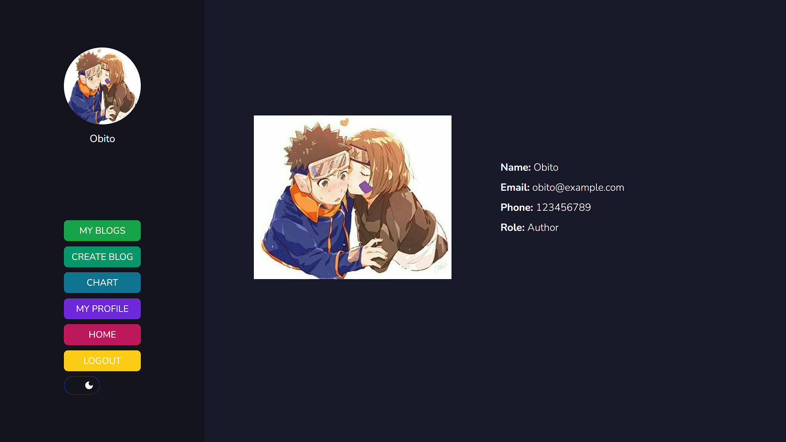

# MERNstack Blog App

- [live demo](https://awwblogs.netlify.app)
## Project Description
This project is a blog platform where users can register, login, and create blog posts. The platform supports user authentication, user roles (e.g., Author), and image uploads using Cloudinary. The project is built with Node.js, Express, MongoDB, and uses bcrypt for password hashing.

## Features
- User Registration and Login
- Password Hashing and Authentication
- User Roles (e.g., Author)
- Blog Post Creation and Management
- Image Upload with Cloudinary

## Setup Instructions

### Prerequisites
- Node.js installed on your machine
- MongoDB installed and running on your machine
- Cloudinary account for image uploads

### Steps to Set Up the Project Locally

1. **Clone the repository**
   ```bash
   git clone https://github.com/Ketan-33/MERNstack-blog-page.git
   cd MERNstack-blog-page

2. **Set up enviroment**
   ```bash
   cd backend
   copy config.env.example config.env
- edit the .env file with your credentials

3. **Seed the database**
- Inside backend directory
  ```bash
  npm run seed

4. **Install Dependencies and Start project**
- Inside backend and frontend directories run
  ```bash
  npm install
  npm start

5. **Access the application**
   Open your browser and navigate to http://localhost:5173

### Default Login Credentials:


|     Role      |     Email     | Password |
| :-----------: | :-----------: | -------: |
|     Author    |  obito@example.com  |      password123 |


## Screenshots
### Register Page


### Login Page


### Home Page


### Blogs page


### Authors


### Dashboard


### Chart


### Profile page

